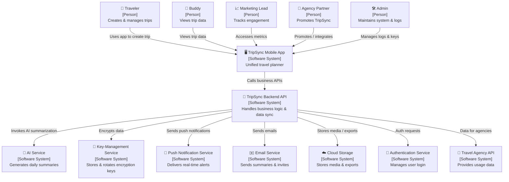

 **1. System Context Description (Prose)**

TripSync is a single, mobile‑first application that lets people plan, record, and share their travel experiences in one place.  When a traveler starts a trip, the app creates a trip profile that can contain an itinerary, expenses, media (photos, videos, voice notes), and notes.  The traveler can invite friends (buddies) to join the trip and assign each of them either “edit” or “view‑only” permissions.  Buddies can read the trip data but cannot alter it.

The app automatically splits expenses, categorises spend, and sends real‑time push notifications and e‑mail alerts when balances change.  An AI layer analyses all activity each day and generates a concise summary that highlights key moments, cost insights, and itinerary suggestions.  Travelers can export the entire trip (PDF, ZIP, or both) and share it or keep it as a backup.  All work can be done offline; changes are stored locally and synchronized with the cloud when connectivity is restored.

The system protects user data with AES‑256 encryption at rest and TLS 1.3 in transit, uses an external key‑management service for key rotation, and logs every change in a tamper‑evident audit trail.  It meets strict performance, scalability, and compliance requirements (GDPR, CCPA, PCI‑DSS, ISO 27001).

**Value to stakeholders**
* **Travelers** – eliminates the need to juggle multiple tools, reduces daily effort by ~45 min, and gives a single, searchable narrative of the journey.
* **Buddies** – stay informed of itineraries and balances without risk of accidental edits.
* **Product Marketing** – provides clear differentiation, engagement metrics, and a channel for upselling premium services.
* **Travel Agency Partners** – can embed or promote TripSync to their clients and receive transparent usage reports.

---

**2. Diagram Key & Element Breakdown**

| Category | Element | One‑Line Description |
|----------|---------|-----------------------|
| **Software System in Scope** | **TripSync Mobile App** | Unified travel‑planning, expense, media, and AI‑summary mobile application |
| **People / Actors** | **Traveler** | Trip owner who creates and manages the trip |
| | **Buddy** | Friend who views trip data (view‑only) |
| | **Product Marketing Lead** | Stakeholder who tracks engagement and retention |
| | **Travel Agency Partner** | Third‑party agency that promotes or integrates TripSync |
| | **Admin** | System operator who manages audit logs, encryption, and duplicate‑merge decisions |
| **External Software Systems** | **AI Service** | Cloud‑based LLM that generates daily summaries |
| | **Key‑Management Service (AWS KMS / Azure Key Vault / GCP KMS)** | Stores and rotates encryption keys |
| | **Push Notification Service** | Sends real‑time push notifications to mobile devices |
| | **Email Service** | Sends summary and invitation emails |
| | **Cloud Storage (S3 / GCS / Azure Blob)** | Stores media files, PDF/ZIP exports, and backups |
| | **Authentication Service** | Handles user sign‑in / sign‑up (OAuth / OpenID Connect) |
| | **Travel Agency API** | Optional integration point for agencies to pull usage data |

---

**3. System Context Diagram (Mermaid)**

