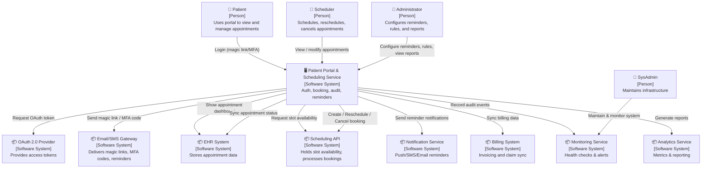

**1. System Context Description (Prose)**

The **Patient Portal & Scheduling Service** is a web‑based platform that lets patients view, book, reschedule, and cancel medical appointments.
When a patient visits the portal, they authenticate with a password‑less flow: a magic link is emailed or texted, or a biometric prompt is shown on a supported device. The portal then obtains a short‑lived OAuth 2.0 access token from an external identity provider, establishes a session, and immediately shows the patient a dashboard with their upcoming appointments.

From the dashboard the patient can:

* **Book** a new appointment – the portal shows real‑time available slots for a chosen provider and specialty, lets the patient pick a slot, and confirms the booking.
* **Reschedule** an existing appointment – the portal presents a calendar, performs a real‑time availability check, and updates the appointment if the slot is still free.
* **Cancel** an appointment – the portal asks for confirmation, updates the status, and releases the slot for other patients.

Every action is logged in an immutable audit trail that retains entries for 24 months (or longer for compliance). The portal also sends reminder notifications (email, SMS, or push) before scheduled appointments and records patient responses (“Yes, I will attend” / “No, I will not attend”).

The system is built to be highly secure: all data in transit is protected by TLS 1.3, all stored data is encrypted with AES‑256, and role‑based access control ensures that only authorized staff can view or modify sensitive information.

---

**2. Diagram Key & Element Breakdown**

| Category | Element | One‑line description |
|----------|---------|----------------------|
| **Software System in Scope** | **Patient Portal & Scheduling Service** | Web portal that handles authentication, appointment booking/rescheduling/cancellation, reminders, and audit logging. |
| **People / Actors** | **Patient** | End‑user who logs in, views appointments, and manages their own scheduling. |
| | **Clinic Scheduler** | Staff who can create, modify, and cancel appointments on behalf of patients. |
| | **Clinic Administrator** | Staff who configure reminder templates, manage scheduling rules, and view compliance reports. |
| | **System Administrator** | Maintains the platform, monitors uptime, and manages infrastructure. |
| **External Software Systems** | **OAuth 2.0 Provider** | Issues access tokens for user authentication. |
| | **Email/SMS Gateway** | Delivers magic links, MFA codes, and reminder notifications. |
| | **Scheduling API** | Supplies real‑time slot availability and accepts booking/reschedule/cancel requests. |
| | **EHR System** | Stores patient records and appointment status; pushes updates to the portal. |
| | **Billing System** | Receives appointment data for invoicing and syncs claim status back to the portal. |
| | **Notification Service** | Sends push, email, and SMS reminders and tracks delivery status. |
| | **Analytics Service** | Aggregates usage metrics, no‑show rates, and generates reports. |
| | **Monitoring Service** | Provides health checks, uptime metrics, and alerts for the portal. |

---

**3. System Context Diagram (Mermaid)**

