## OUTPUT 1 – ARCHITECT NARRATIVE

### 1. Architecture style
The system is built as a **micro‑service ecosystem with an event‑driven backbone**.
A **Backend‑For‑Frontend (BFF)** layer (Auth API) speaks directly to the SPA, while the remaining business capabilities – booking, notification, audit – are isolated into dedicated services.  All services publish and consume events through a **Kafka** cluster, guaranteeing eventual consistency and the ability to replay or back‑fill data.  This style satisfies the stringent scalability, audit‑log durability, and security requirements: each service can be scaled, secured, and upgraded independently, and the event bus guarantees that audit data is captured before any mutation is persisted.

### 2. Container decomposition
| Boundary | Container | Why it exists |
|----------|-----------|---------------|
| **Front‑end** | `Patient Portal SPA` | Single‑page UI that consumes the BFF; keeps the browser footprint small and enables instant navigation. |
| **Auth BFF** | `Auth API` | Handles magic‑link generation, MFA, OAuth token acquisition, rate‑limiting and session cookie issuance.  Keeps authentication logic separate from core booking logic. |
| **Booking** | `Booking API` | Orchestrates slot queries, conflict checks, booking, rescheduling and cancellation.  Calls the external Scheduling API, EHR and Billing services. |
| **Notification** | `Notification API` | Schedules reminders, sends push/email/SMS, records delivery status and retries.  Uses the same event bus to react to booking events. |
| **Audit** | `Audit Log API` | Accepts immutable log events from all services and writes them to a write‑once store.  Provides a read‑only API for compliance queries. |
| **Data stores** | `User DB`, `Appointment DB`, `Audit Log DB`, `Redis Cache`, `Kafka` | Each container owns its own schema; isolation protects audit data from accidental corruption. |
| **External connectors** | `OAuth Provider`, `Email/SMS Gateway`, `Scheduling API`, `EHR`, `Billing`, `Push Service`, `Analytics`, `Monitoring` | External systems are treated as black‑box services; the internal services interact with them via well‑defined REST/gRPC contracts. |

The decomposition follows **separation of concerns** (auth vs. booking vs. notification), **team ownership** (each service can be owned by a distinct squad), and **scalability** (high‑traffic login can be scaled independently from booking).

### 3. Data architecture
| Store | Technology | Owner | Access pattern | Isolation strategy |
|-------|------------|-------|----------------|--------------------|
| `User DB` | PostgreSQL | Auth API | CRUD + read‑only queries | Separate schema, read replicas for audit queries |
| `Appointment DB` | PostgreSQL | Booking API | ACID transactions for booking & reschedule | Separate schema, write‑through cache (Redis) |
| `Audit Log DB` | PostgreSQL (append‑only) | Audit Log API | Append‑only writes, immutable reads | Write‑once table, separate read replica |
| `Redis Cache` | Redis | All services | Session tokens, rate‑limit counters, cached slot lists | In‑memory, TTL‑based |
| `Kafka` | Kafka cluster | All services | Event streams for audit, notifications, conflict checks | Topic per domain, retention 7 days |

The audit log store is isolated and immutable; writes are performed before any business mutation, ensuring compliance with FR‑0004 and NFR‑0004.

### 4. Communication patterns
| Direction | Protocol | Participants | Notes |
|-----------|----------|--------------|-------|
| SPA → Auth API | HTTPS + JSON | SPA, Auth API | BFF pattern; session cookie set by Auth API |
| Auth API ↔ OAuth Provider | HTTPS + OAuth 2.0 | Auth API, OAuth Provider | Short‑lived access token |
| Auth API → Kafka | Producer (Avro) | Auth API, Kafka | Emits `UserAuthenticated`, `LoginAttempt` events |
| Booking API ↔ Scheduling API | HTTPS + JSON | Booking API, Scheduling API | Real‑time slot lookup |
| Booking API ↔ EHR / Billing | HTTPS + JSON | Booking API, EHR/Billing | Sync appointment status |
| Booking API → Kafka | Producer | Booking API, Kafka | Emits `AppointmentBooked`, `AppointmentRescheduled`, `AppointmentCancelled` |
| Notification API ↔ Kafka | Consumer | Notification API, Kafka | Consumes booking events, schedules reminders |
| Notification API ↔ Email/SMS Gateway | HTTPS + JSON | Notification API, Gateway | Sends magic link, MFA, reminders |
| Notification API ↔ Push Service | HTTPS | Notification API, Push Service | Push notifications |
| Audit Log API ↔ Kafka | Consumer | Audit Log API, Kafka | Consumes all domain events, writes immutable log |
| SPA ↔ Analytics | HTTPS | SPA, Analytics | User interaction telemetry |
| All services ↔ Monitoring | HTTPS | Services, Monitoring | Health checks, metrics |

The API Gateway (BFF) hides the internal service mesh from the SPA.  Asynchronous events reduce latency for the user while guaranteeing audit capture.

### 5. NFR mapping

| NFR | Container / Decision |
|-----|----------------------|
| NFR‑0000 (TLS 1.3) | All HTTPS endpoints (SPA, Auth API, Booking API, Notification API, Audit API) |
| NFR‑0001 (HIPAA audit) | `Audit Log API` + immutable `Audit Log DB` |
| NFR‑0002 (2 s auth flow) | `Auth API` + `OAuth Provider` (optimised token cache) |
| NFR‑0003 (30 s email/SMS) | `Email/SMS Gateway` integration via `Notification API` |
| NFR‑0004 (99.9 % uptime) | All services behind a load‑balanced cluster; `Monitoring Service` |
| NFR‑0005 (10 k concurrent logins) | `Auth API` horizontally scaled, Redis rate‑limiter |
| NFR‑0006 (95 % patient confidence) | SPA performance, API latency monitoring |
| NFR‑0007 (5 min MFA expiry) | `Auth API` token expiry logic |
| NFR‑0008 (30 min idle session) | `Auth API` session cookie with idle timeout |
| NFR‑0009 (tamper‑evident logs) | `Audit Log API` hash chain, append‑only DB |
| NFR‑0010 (HIPAA‑compliant vendors) | Vendor contracts; external connectors validated |
| NFR‑0011 (API & UI latency) | `Booking API` and SPA measured via APM |
| NFR‑0012 (high reliability of availability view) | `Scheduling API` retries + local cache |
| NFR‑0013 (secure data in transit) | All inter‑service HTTPS, TLS 1.2+ |
| NFR‑0014 (10 k concurrent patients) | SPA stateless, API horizontal scaling |
| NFR‑0015 (90 % first‑page slot discovery) | `Booking API` caching + efficient slot aggregation |
| NFR‑0016 (24/7 availability) | `Scheduling API` fail‑over, local queueing |
| NFR‑0017 (WCAG 2.1 AA) | SPA accessibility audit |
| NFR‑0018 (2 s end‑to‑end reschedule) | `Booking API` + async notification, optimistic UI |
| NFR‑0019 (99.9 % reschedule uptime) | `Booking API` cluster & circuit breaker |
| NFR‑0020 (10 % load spike tolerance) | Auto‑scaling policies, queue back‑pressure |
| NFR‑0021 (encryption at rest & in transit) | All databases encrypted, TLS 1.3 for all traffic |
| NFR‑0022 (HIPAA compliance) | Combined with NFR‑0001, 0003, 0013 |

*(Only a representative subset of NFRs is shown; the full mapping follows the same pattern.)*

### 6. Risks & trade‑offs

| Risk | Impact | Mitigation |
|------|--------|------------|
| **Event‑driven data consistency** – booking may be committed before EHR sync | Lost or stale appointment data in EHR | Use transactional outbox pattern; retry EHR updates, expose compensation logic |
| **Audit log performance bottleneck** – high volume of events may overwhelm the log store | Latency in booking flow | Partition audit topic, use a dedicated high‑throughput DB, async write with retry |
| **Single point of authentication** – Auth API could become a bottleneck | Login latency spikes | Horizontal scaling, sticky sessions, rate‑limit per IP, use a CDN for static assets |

---

## OUTPUT 2 – ELEMENT BREAKDOWN TABLES

### Application Containers

| Name | Type | Technology | Responsibility | Exposes | Consumes |
|------|------|------------|----------------|---------|----------|
| `Patient Portal SPA` | SPA | React / Angular | UI for patients, dashboards, booking flows | HTTPS (SPA) | Auth API, Booking API, Notification API, Analytics |
| `Auth API` | BFF / Auth Service | Node.js / Spring Boot | Magic‑link, MFA, OAuth token, session, rate‑limit | HTTPS | OAuth Provider, Email/SMS Gateway, Redis, Kafka |
| `Booking API` | Booking Service | Node.js / Spring Boot | Slot lookup, booking, reschedule, cancel, conflict check | HTTPS | Scheduling API, EHR, Billing, Redis, Kafka |
| `Notification API` | Notification Service | Node.js / Spring Boot | Reminder scheduling, send email/SMS/push, retry | HTTPS | Email/SMS Gateway, Push Service, Kafka |
| `Audit Log API` | Audit Service | Node.js / Spring Boot | Immutable audit log ingestion, query | HTTPS | Kafka, Audit Log DB |

### Data Store Containers

| Name | Store Type | Technology | Owned By | Access Pattern |
|------|------------|------------|----------|----------------|
| `User DB` | Relational | PostgreSQL | Auth API | CRUD, read‑only queries |
| `Appointment DB` | Relational | PostgreSQL | Booking API | ACID transactions |
| `Audit Log DB` | Relational (append‑only) | PostgreSQL | Audit Log API | Append‑only, read‑only |
| `Redis Cache` | In‑Memory | Redis | All services | Session tokens, rate‑limit counters, cached slot lists |
| `Kafka` | Message Broker | Apache Kafka | All services | Event streams (audit, notifications, booking) |

### Supporting Elements (Level 1)

| Element | Type | Touches Which Container |
|---------|------|------------------------|
| `OAuth Provider` | External System | Auth API |
| `Email/SMS Gateway` | External System | Auth API, Notification API |
| `Scheduling API` | External System | Booking API |
| `EHR System` | External System | Booking API |
| `Billing System` | External System | Booking API |
| `Push Service (Firebase/FCM)` | External System | Notification API |
| `Analytics Service` | External System | SPA, Booking API |
| `Monitoring Service` | External System | All services |

---

## OUTPUT 3 — MERMAID CONTAINER DIAGRAM

```mermaid
---
title: Patient Portal & Scheduling Service — C4 Level 2 Container Diagram
---
graph TD

  %% ── Actors ───────────────────────────────────────────────
  Patient["👤 Patient\n[Person]\nUses portal to view and manage appointments"]
  Scheduler["👤 Scheduler\n[Person]\nCreates / edits appointments on behalf of patients"]
  Admin["👤 Administrator\n[Person]\nConfigures reminders, scheduling rules & reports"]
  SysAdmin["👤 System Administrator\n[Person]\nMaintains infra & monitors health"]

  %% ── System Boundary ───────────────────────────────────────
  subgraph Boundary["🔲 Patient Portal & Scheduling Service"]
    %% ── Front‑end ────────────────────────────────────────
    SPA["⬜ Frontend SPA\n[React]\nHandles UI & user interactions"]

    %% ── Authentication / Session ───────────────────────────
    AuthService["⬛ Auth Service\n[Spring Boot]\nMagic‑link, MFA, OAuth token, session cookie"]

    %% ── Appointment & Scheduling ───────────────────────────
    AppointmentService["⬛ Appointment Service\n[Spring Boot]\nBooking, rescheduling, cancellation, rule‑engine"]

    %% ── Notification (reminders, push) ─────────────────────
    NotificationService["⬛ Notification Service\n[Spring Boot]\nPush / Email / SMS reminders"]

    %% ── Audit / Logging ───────────────────────────────────
    AuditService["⬛ Audit Service\n[Spring Boot]\nImmutably records events (write‑once DB)"]

    %% ── Data Stores ───────────────────────────────────────
    AppDB[("🗄️ Appointment DB\n[PostgreSQL]")]
    Cache[("⚡ Cache\n[Redis]")]
    BlobStore[("🪣 Blob Store\n[Amazon S3]")]
    Queue[("📨 Queue\n[RabbitMQ]")]
  end

  %% ── External Systems ─────────────────────────────────────
  OAuthProvider["📦 OAuth 2.0 Provider\n[Identity Provider]\nIssues short‑lived access tokens"]
  EmailSMSGateway["📦 Email/SMS Gateway\n[Twilio / SendGrid]\nDelivers magic links, MFA codes, reminders"]
  SchedulingAPI["📦 Scheduling API\n[External Service]\nProvides slot availability, accepts bookings"]
  EHRSystem["📦 EHR System\n[Electronic Health Record]\nStores appointment status & patient data"]
  BillingSystem["📦 Billing System\n[Billing Platform]\nReceives appointment data, syncs claim status"]
  NotificationExternal["📦 Notification Service\n[Push Service]\nHandles push notifications"]
  AnalyticsService["📦 Analytics Service\n[Analytics Platform]\nAggregates usage metrics & reports"]
  MonitoringService["📦 Monitoring Service\n[Observability Platform]\nHealth checks, alerts & metrics"]

  %% ── Relationships (what + protocol) ───────────────────────
  Patient -- "HTTPS (TLS 1.3)" --> SPA
  SPA -- "REST API (JSON/HTTPS)" --> AuthService
  AuthService -- "OAuth token request (HTTPS)" --> OAuthProvider
  AuthService -- "Session cookie" --> SPA
  SPA -- "REST API (JSON/HTTPS)" --> AppointmentService
  AppointmentService -- "Read/Write (SQL)" --> AppDB
  AppointmentService -- "Cache (Redis protocol)" --> Cache
  AppointmentService -- "Publish events (AMQP)" --> Queue
  AppointmentService -- "HTTP (JSON/HTTPS)" --> SchedulingAPI
  AppointmentService -- "HTTP (JSON/HTTPS)" --> EHRSystem
  AppointmentService -- "HTTP (JSON/HTTPS)" --> BillingSystem
  AppointmentService -- "HTTP (JSON/HTTPS)" --> NotificationService
  NotificationService -- "Publish events (AMQP)" --> Queue
  NotificationService -- "Send via Email/SMS (HTTPS)" --> EmailSMSGateway
  NotificationService -- "Push via Notification External (HTTPS)" --> NotificationExternal
  NotificationService -- "Store logs (S3)" --> BlobStore
  AuditService -- "Write (SQL)" --> AppDB
  Queue -- "Consume" --> AuthService
  Queue -- "Consume" --> AppointmentService
  Queue -- "Consume" --> NotificationService
  Queue -- "Consume" --> AuditService
  SPA -- "Static assets (HTTPS)" --> BlobStore
  MonitoringService -- "Health checks (HTTPS)" --> SPA
  MonitoringService -- "Health checks (HTTPS)" --> AuthService
  MonitoringService -- "Health checks (HTTPS)" --> AppointmentService
  MonitoringService -- "Health checks (HTTPS)" --> NotificationService
  MonitoringService -- "Health checks (HTTPS)" --> AuditService
  AnalyticsService -- "Data ingestion (HTTPS)" --> AppointmentService
  AnalyticsService -- "Query (HTTPS)" --> SPA

  %% ── Styles ───────────────────────────────────────────────
  style Boundary  fill:#f9f9f9,stroke:#999,stroke-dasharray:5 5
  style Patient     fill:#2196F3,color:#fff,stroke:#1565C0
  style Scheduler   fill:#2196F3,color:#fff,stroke:#1565C0
  style Admin       fill:#2196F3,color:#fff,stroke:#1565C0
  style SysAdmin    fill:#2196F3,color:#fff,stroke:#1565C0
  style SPA         fill:#4CAF50,color:#fff,stroke:#2E7D32
  style AuthService fill:#1B5E20,color:#fff,stroke:#1B5E20
  style AppointmentService fill:#1B5E20,color:#fff,stroke:#1B5E20
  style NotificationService fill:#1B5E20,color:#fff,stroke:#1B5E20
  style AuditService fill:#1B5E20,color:#fff,stroke:#1B5E20
  style AppDB       fill:#5C6BC0,color:#fff,stroke:#283593
  style Cache       fill:#5C6BC0,color:#fff,stroke:#283593
  style BlobStore   fill:#5C6BC0,color:#fff,stroke:#283593
  style Queue       fill:#FF9800,color:#fff,stroke:#E65100
  style OAuthProvider fill:#9E9E9E,color:#fff,stroke:#424242
  style EmailSMSGateway fill:#9E9E9E,color:#fff,stroke:#424242
  style SchedulingAPI fill:#9E9E9E,color:#fff,stroke:#424242
  style EHRSystem fill:#9E9E9E,color:#fff,stroke:#424242
  style BillingSystem fill:#9E9E9E,color:#fff,stroke:#424242
  style NotificationExternal fill:#9E9E9E,color:#fff,stroke:#424242
  style AnalyticsService fill:#9E9E9E,color:#fff,stroke:#424242
  style MonitoringService fill:#9E9E9E,color:#fff,stroke:#424242
```

### Container‑level technology stack

| Container | Technology | One‑line description |
|-----------|------------|-----------------------|
| **SPA** | React (TypeScript) | Client‑side UI, routing, state management |
| **Auth Service** | Spring Boot (Java) | Handles magic‑link, MFA, OAuth 2.0, session cookie |
| **Appointment Service** | Spring Boot (Java) | Booking, rescheduling, cancellation, rule‑engine, conflict checking |
| **Notification Service** | Spring Boot (Java) | Push/email/SMS queue consumer, reminder orchestration |
| **Audit Service** | Spring Boot (Java) | Append‑only audit log, immutable storage |
| **Appointment DB** | PostgreSQL | Relational store for appointments, users, audit metadata |
| **Cache** | Redis | In‑memory cache for slot availability & session data |
| **Blob Store** | Amazon S3 | Static assets, audit snapshots, logs |
| **Queue** | RabbitMQ | Async event bus (auth events, booking events, notification events, audit events) |

External systems are treated as *outside the subgraph* (boundary rule) and are **not** containers of the Patient Portal & Scheduling Service.

---
