## OUTPUT 1 – ARCHITECT NARRATIVE

### 1. Container selection rationale
The **Appointment Service** is the most complex, critical, and team‑owned container in the Patient Portal & Scheduling Service. It orchestrates three core user journeys (book, reschedule, cancel), enforces business rules (conflict‑check, no‑show window, reschedule window), and bridges the portal with several external systems (Scheduling API, EHR, Billing, Notification). Its code base spans dozens of packages, each with its own sub‑domain, and the service is the single point of failure for all appointment‑related flows. Because the service must meet stringent latency, audit‑log, and regulatory requirements, a Level‑3 decomposition is essential to expose the internal boundaries that will be owned by the “Scheduling” squad and to surface the cross‑cutting concerns that must be shared with other teams.

### 2. Component identification strategy
Classes and interfaces were grouped along the **Domain‑Driven Design (DDD) layers**:

| Layer | Group | Typical classes |
|-------|-------|-----------------|
| **Presentation** | **BookingController** | REST endpoints for `/book`, `/reschedule`, `/cancel` |
| **Application** | **BookingService** | Orchestrates the flow, calls domain objects, publishes events |
| **Domain** | **AppointmentAggregate** | Encapsulates state, invariants, and rule checks |
| | **ConflictChecker** | Stateless service that queries the Scheduling API and EHR |
| | **RuleEngine** | Evaluates admin‑defined rules (crowd limits, session length) |
| **Infrastructure** | **AppointmentRepository** | JPA/Hibernate access to PostgreSQL |
| | **EventPublisher** | Publishes domain events to Kafka |
| | **EventListener** | Consumes audit and notification events |
| | **Gateway** | Adapters to external Scheduling API, EHR, Billing, Notification |
| **Cross‑cutting** | **Validator** | Bean‑validation, business‑rule guard |
| | **Cache** | Redis cache for slot lists and rate‑limit counters |

The grouping follows the **hexagonal (ports‑adapters) pattern**: the core domain (aggregate, rules) is isolated from external adapters, which are injected via interfaces. This makes the service testable, replaceable, and keeps the business logic pure.

### 3. Architectural pattern
The internal structure is a **clean‑architecture / hexagonal pattern** with an event‑driven side‑effect layer.
* **Clean‑architecture** keeps the domain free of infrastructure code and allows the service to be unit‑tested in isolation.
* **Event‑driven** (Kafka) decouples the core business flow from side‑effects such as audit logging and notifications, guaranteeing that the audit record is persisted before any external state changes.
* The service also implements **CQRS** for the read side: a read‑only projection (`AppointmentReadModel`) is updated via event listeners, allowing fast slot‑availability queries without locking the write‑model.

This combination satisfies the NFRs around audit‑log durability, 2‑second booking latency, and 99.9 % uptime.

### 4. Component responsibilities
| Core | Responsibility |
|------|----------------|
| **BookingController** | Exposes REST endpoints, performs request validation, delegates to BookingService |
| **BookingService** | Orchestrates booking, reschedule, cancel; coordinates conflict‑check, rule‑engine, persistence, and event publication |
| **AppointmentAggregate** | Holds appointment state, enforces invariants (no double‑booking, no‑show, reschedule window) |
| **ConflictChecker** | Calls the external Scheduling API and EHR to determine slot availability; returns a conflict status |
| **RuleEngine** | Loads admin‑defined rules from a config store, applies them during booking/reschedule |
| **AppointmentRepository** | Persists AppointmentAggregate via JPA; provides query methods for the read model |
| **EventPublisher** | Publishes domain events (`AppointmentBooked`, `AppointmentRescheduled`, `AppointmentCancelled`) to Kafka |
| **EventListener** | Consumes events to update the read‑model and to trigger notifications |
| **Gateway** | Adapters for Scheduling API, EHR, Billing, and Notification Service |
| **Validator** | Enforces business‑rule guards and data‑format validation |
| **Cache** | Caches slot lists and rate‑limit counters in Redis |

Supporting components (AuthMiddleware, Logging, Metrics) are shared with other containers but are injected into the service via dependency injection.

### 5. Risks & coupling concerns

| Risk | Impact | Mitigation |
|------|--------|------------|
| **Tight coupling to external Scheduling API** | A change or outage in the API can block all booking flows. | Use an outbox pattern: persist the booking locally, publish an event, and retry the external call asynchronously. |
| **Event ordering between audit and notification** | If the audit event is delayed, the system may lose the guarantee that audit logs precede notifications. | Implement a transactional outbox that writes the audit event and the booking event in the same DB transaction; use Kafka’s exactly‑once semantics. |
| **Data consistency between Appointment DB and EHR** | Race conditions can leave the portal and EHR in different states. | Wrap the EHR sync in a compensating transaction; if the EHR update fails, roll back the appointment creation and emit a compensation event. |

---

## OUTPUT 2 – COMPONENT BREAKDOWN TABLE

| Component Name | Type | Technology/Pattern | Responsibility | Interfaces Exposed | Dependencies |
|----------------|------|--------------------|----------------|---------------------|--------------|
| **BookingController** | Controller / Route Handler | Spring MVC | Handles HTTP requests for book/reschedule/cancel | `POST /book`, `POST /reschedule`, `DELETE /cancel/{id}` | AuthMiddleware, BookingService |
| **BookingService** | Service / Business Logic | Spring Service | Orchestrates booking flow, calls domain objects, publishes events | `book`, `reschedule`, `cancel` | AppointmentAggregate, ConflictChecker, RuleEngine, AppointmentRepository, EventPublisher, Validator |
| **AppointmentAggregate** | Domain Entity | DDD Aggregate | Holds appointment state, enforces invariants | N/A (used internally) | ConflictChecker, RuleEngine |
| **ConflictChecker** | Service / Business Logic | Spring Service | Queries Scheduling API & EHR for conflicts | `checkConflict` | SchedulingGateway, EHRGateway, Cache |
| **RuleEngine** | Service / Business Logic | Spring Service | Applies admin‑defined rules (crowd limits, session length) | `applyRules` | RuleConfigRepository |
| **AppointmentRepository** | Repository / Data Access | Spring Data JPA | Persists AppointmentAggregate, provides read‑model queries | `save`, `findById`, `findAllByCriteria` | PostgreSQL |
| **EventPublisher** | Event Publisher | Spring Kafka Producer | Publishes domain events to Kafka | `publish(appointmentEvent)` | KafkaTemplate |
| **EventListener** | Event Listener / Consumer | Spring Kafka Consumer | Consumes events to update read‑model & trigger notifications | `onAppointmentBooked`, `onAppointmentRescheduled`, `onAppointmentCancelled` | AppointmentReadModelRepository, NotificationGateway |
| **SchedulingGateway** | Gateway / Adapter | RestTemplate / Feign | Calls external Scheduling API | `getAvailableSlots`, `createBooking` | External Scheduling API |
| **EHRGateway** | Gateway / Adapter | RestTemplate / Feign | Reads/writes appointment status in EHR | `syncAppointment` | External EHR |
| **BillingGateway** | Gateway / Adapter | RestTemplate / Feign | Sends appointment data to Billing | `notifyAppointment` | External Billing |
| **NotificationGateway** | Gateway / Adapter | RestTemplate / Feign | Sends push/email/SMS reminders | `sendReminder` | External Notification Service |
| **Validator** | Validator / Guard | Bean Validation | Validates incoming DTOs & business rules | N/A | BookingService |
| **Cache** | Shared / Cross‑cutting | Redis | Caches slot lists & rate‑limit counters | N/A | ConflictChecker, BookingService |

---

## OUTPUT 3 – MERMAID COMPONENT DIAGRAM

```mermaid
---
title: Appointment Service — C4 Level 3 Component Diagram
---
graph TD

  %% ── People (Supporting) ─────────────────────────────────────
  Patient["👤 Patient\n[Person]\nUses portal to book, reschedule, cancel"]

  %% ── External Systems (Supporting) ─────────────────────────────
  SchedulingAPI["📦 Scheduling API\n[External]\nProvides slot availability"]
  EHRSystem["📦 EHR\n[External]\nStores appointment status"]
  BillingSystem["📦 Billing\n[External]\nReceives appointment data"]
  NotificationService["📦 Notification\n[External]\nSends push/email/SMS"]

  %% ── Container Boundary ───────────────────────────────────────
  subgraph Boundary["🔲 Appointment Service — Java/Spring"]
    %% ── Controllers / Entry Points ─────────────────────────────
    BookingController["[Component]\n[Controller]\nHandles REST requests"]

    %% ── Services / Business Logic ───────────────────────────────
    BookingService["[Component]\n[Service]\nOrchestrates booking flow"]
    AppointmentAggregate["[Component]\n[Domain]\nAppointment aggregate"]
    ConflictChecker["[Component]\n[Service]\nChecks slot conflicts"]
    RuleEngine["[Component]\n[Service]\nApplies admin rules"]

    %% ── Repositories / Data Access ─────────────────────────────
    AppointmentRepository["[Component]\n[Repository]\nJPA access"]

    %% ── Gateways / Adapters ────────────────────────────────────
    SchedulingGateway["[Component]\n[Gateway]\nCalls Scheduling API"]
    EHRGateway["[Component]\n[Gateway]\nCalls EHR"]
    BillingGateway["[Component]\n[Gateway]\nCalls Billing"]
    NotificationGateway["[Component]\n[Gateway]\nCalls Notification Service"]

    %% ── Event Handling ────────────────────────────────────────
    EventPublisher["[Component]\n[Event Publisher]\nPublishes domain events"]
    EventListener["[Component]\n[Event Listener]\nConsumes events for read‑model & notifications"]

    %% ── Cross‑cutting ─────────────────────────────────────────
    Validator["[Component]\n[Validator]\nValidates DTOs & guards"]
    Cache["[Component]\n[Cache]\nRedis for slot & rate‑limit"]
    AuthMiddleware["[Component]\n[Middleware]\nAuth & RBAC"]
  end

  %% ── Relationships ─────────────────────────────────────────
  Patient -- "HTTPS (TLS 1.3)" --> BookingController
  BookingController -- "Delegates" --> AuthMiddleware
  AuthMiddleware -- "Passes" --> BookingService
  BookingService -- "Creates/Updates" --> AppointmentAggregate
  AppointmentAggregate -- "Persists via" --> AppointmentRepository
  BookingService -- "Calls" --> ConflictChecker
  ConflictChecker -- "Uses" --> SchedulingGateway
  ConflictChecker -- "Uses" --> EHRGateway
  BookingService -- "Calls" --> RuleEngine
  RuleEngine -- "Loads rules from" --> RuleConfigRepository
  BookingService -- "Publishes" --> EventPublisher
  EventPublisher -- "Sends to" --> Kafka
  EventListener -- "Consumes from" --> Kafka
  EventListener -- "Updates read‑model" --> AppointmentReadModelRepository
  EventListener -- "Triggers" --> NotificationGateway
  BookingService -- "Caches" --> Cache
  BookingService -- "Validates" --> Validator
  BookingService -- "Syncs to" --> BillingGateway

  %% ── Styles ───────────────────────────────────────────────
  style Boundary  fill:#f9f9f9,stroke:#999,stroke-dasharray:5 5
  style Patient    fill:#2196F3,color:#fff,stroke:#1565C0
  style SchedulingAPI fill:#9E9E9E,color:#fff,stroke:#424242
  style EHRSystem  fill:#9E9E9E,color:#fff,stroke:#424242
  style BillingSystem fill:#9E9E9E,color:#fff,stroke:#424242
  style NotificationService fill:#9E9E9E,color:#fff,stroke:#424242

  style BookingController   fill:#4CAF50,color:#fff,stroke:#2E7D32
  style BookingService      fill:#4CAF50,color:#fff,stroke:#2E7D32
  style AppointmentAggregate fill:#4CAF50,color:#fff,stroke:#2E7D32
  style ConflictChecker    fill:#4CAF50,color:#fff,stroke:#2E7D32
  style RuleEngine         fill:#4CAF50,color:#fff,stroke:#2E7D32
  style AppointmentRepository fill:#4CAF50,color:#fff,stroke:#2E7D32
  style SchedulingGateway  fill:#4CAF50,color:#fff,stroke:#2E7D32
  style EHRGateway         fill:#4CAF50,color:#fff,stroke:#2E7D32
  style BillingGateway     fill:#4CAF50,color:#fff,stroke:#2E7D32
  style NotificationGateway fill:#4CAF50,color:#fff,stroke:#2E7D32
  style EventPublisher     fill:#FF9800,color:#fff,stroke:#E65100
  style EventListener      fill:#FF9800,color:#fff,stroke:#E65100
  style Validator          fill:#F44336,color:#fff,stroke:#B71C1C
  style Cache              fill:#FFEB3B,color:#000,stroke:#F57F17
  style AuthMiddleware     fill:#F44336,color:#fff,stroke:#B71C1C
```

---

## OUTPUT 4 – TRACEABILITY MATRIX

| Component | Functional Requirements (excerpt) | NFRs Addressed (excerpt) | Level 2 Container |
|-----------|-----------------------------------|---------------------------|-------------------|
| **BookingController** | FR‑0009 (slot availability), FR‑0011 (booking), FR‑0015 (reschedule) | NFR‑0002 (auth latency), NFR‑0011 (API latency) | Appointment Service |
| **BookingService** | FR‑0009, FR‑0011, FR‑0045 (cancel), FR‑0046 (notification after cancel) | NFR‑0011 (2 s booking), NFR‑0009 (tamper‑evident audit) | Appointment Service |
| **ConflictChecker** | FR‑0009, FR‑0006 (MFA expiry), FR‑0050 (rule engine) | NFR‑0011 (API latency), NFR‑0003 (email/SMS 30 s) | Appointment Service |
| **RuleEngine** | FR‑0050 (rule enforcement) | NFR‑0011 (latency), NFR‑0009 (audit) | Appointment Service |
| **AppointmentRepository** | FR‑0011, FR‑0015, FR‑0045 | NFR‑0011 (DB latency), NFR‑0012 (high reliability) | Appointment Service |
| **EventPublisher** | FR‑0009, FR‑0011, FR‑0045 | NFR‑0009 (audit), NFR‑0014 (99.9 % uptime) | Appointment Service |
| **EventListener** | FR‑0046 (reminders), FR‑0047 (audit cancel) | NFR‑0009 (audit), NFR‑0015 (UX) | Appointment Service |
| **SchedulingGateway** | FR‑0009 (slot lookup) | NFR‑0013 (TLS), NFR‑0012 (graceful degradation) | Appointment Service |
| **EHRGateway** | FR‑0011 (sync status) | NFR‑0013 (TLS), NFR‑0012 (graceful degradation) | Appointment Service |
| **BillingGateway** | FR‑0011 (billing sync) | NFR‑0013 (TLS) | Appointment Service |
| **NotificationGateway** | FR‑0046 (reminder), FR‑0047 (audit) | NFR‑0003 (30 s), NFR‑0015 (UX) | Appointment Service |
| **Validator** | FR‑0015 (reschedule window) | NFR‑0011 (latency), NFR‑0015 (UX) | Appointment Service |
| **Cache** | FR‑0009 (slot caching) | NFR‑0015 (UX), NFR‑0016 (24/7) | Appointment Service |

---
