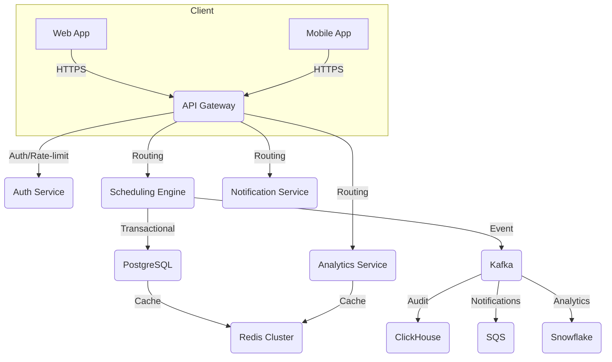
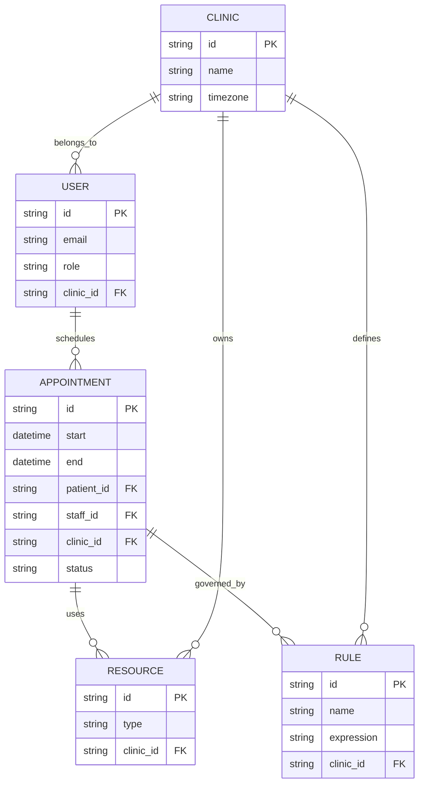
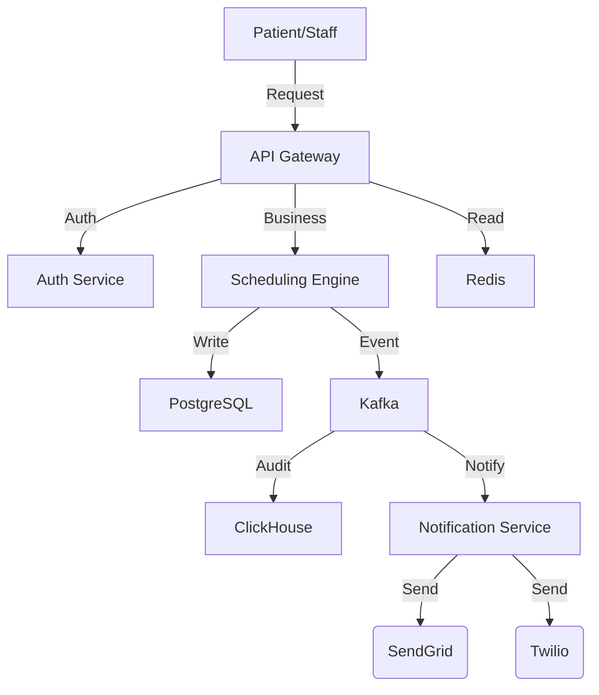
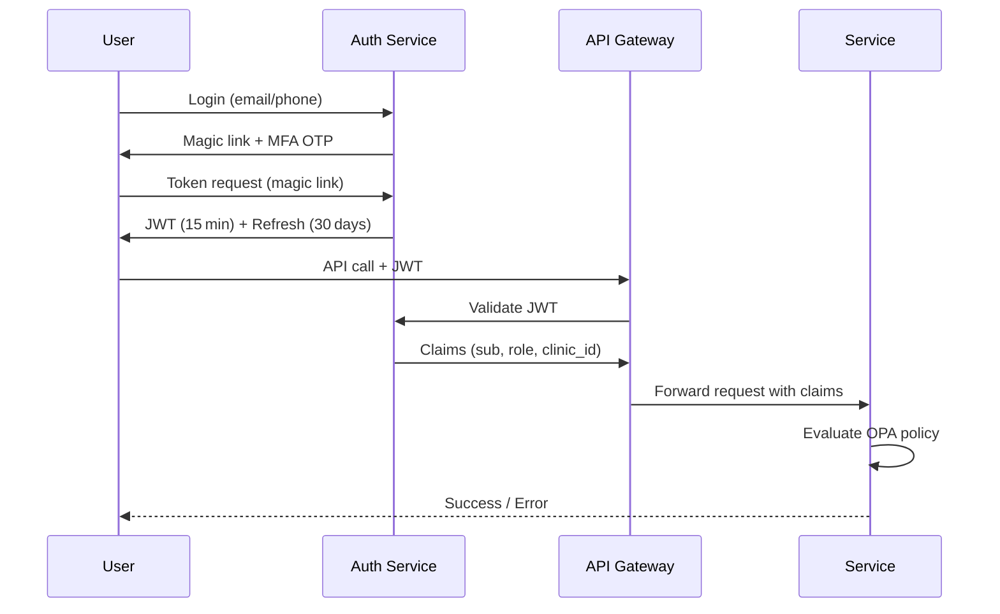
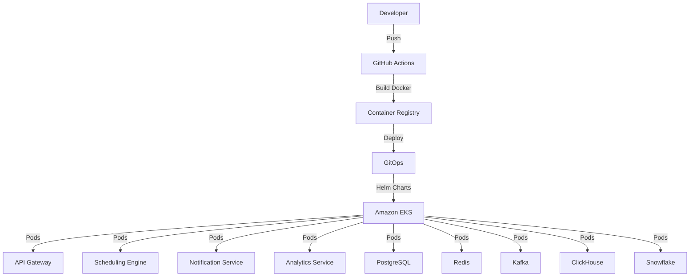
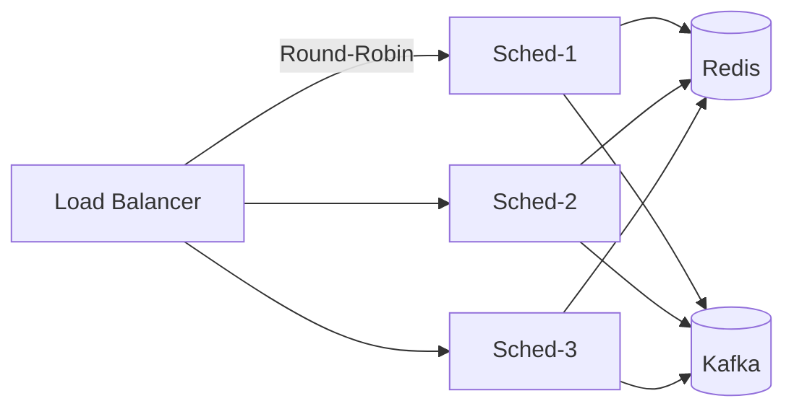

# Technical Architecture Document

## 1. Overview & Goals

| Item | Detail |
|------|--------|
| **System Purpose** | A cloud‑native outpatient clinic scheduling platform that replaces spreadsheets and phone‑based coordination. It detects, reports, and automatically resolves appointment conflicts in real‑time while enforcing clinic rules (crowd limits, appointment lengths, staff availability). |
| **PRD Alignment** | • **Real‑time conflict detection** → Scheduling Engine + Rule Engine.<br>• **Atomic resolution** → Single‑transaction updates in PostgreSQL.<br>• **Password‑less patient portal** → Auth0/OIDC + magic‑link MFA.<br>• **Auditability & notifications** → Kafka event stream + ClickHouse audit store + SendGrid/Twilio notifications.<br>• **Offline resilience** → Local persistent store for staff edits (SQLite/IndexedDB). |
| **Non‑Goals** | • Tele‑health video or tele‑consultation services.<br>• Billing or payment processing.<br>• Full EHR integration (only basic FHIR read‑only for patient data). |

**Assumptions**
* Multi‑tenant deployment (one instance per clinic).
* AWS is the primary cloud provider unless otherwise specified.
* The platform will be built in 3–4 release cycles; the architecture is stable from the outset.

---

## 2. System Architecture Diagram



**Key Points**

* **API Gateway** handles TLS termination, rate limiting, and request routing.
* **Auth Service** issues JWTs (15 min access, 30 day refresh) and validates them in the gateway.
* **Scheduling Engine** is a Go micro‑service that performs conflict detection, rule evaluation, and writes to PostgreSQL atomically.
* **Notification Service** (Python + Celery) consumes Kafka events and sends email/SMS/webhooks.
* **Analytics Service** aggregates data in Snowflake for dashboards.
* **Redis** provides sub‑second availability look‑ups and cache invalidation via pub/sub.

---

## 3. Component Breakdown

```mermaid
graph LR
  subgraph Frontend
    UI[React/Next.js SPA]
  end
  subgraph Backend
    API[API Gateway (NestJS)]
    Auth[Auth Service (Auth0/Okta)]
    Sched[Scheduling Engine (Go)]
    Notify[Notification Service (Python)]
    Analytics[Analytics Service (Python)]
  end
  subgraph Data
    DB[(PostgreSQL / CockroachDB)]
    Event[(Kafka)]
    Audit[(ClickHouse)]
    Cache[(Redis Cluster)]
    LongTerm[(Snowflake)]
  end
  UI --> API
  API --> Auth
  API --> Sched
  API --> Notify
  API --> Analytics
  Sched --> DB
  Sched --> Event
  Event --> Audit
  Event --> Notify
  Event --> Analytics
  DB --> Cache
  Analytics --> LongTerm
```

| Component | Responsibility | Boundary |
|-----------|----------------|----------|
| **UI** | Patient & staff portal (React/Next.js). | Front‑end only. |
| **API Gateway** | TLS, rate‑limit, routing, JWT validation. | Entry point. |
| **Auth Service** | Identity, magic‑link MFA, token issuance. | Auth domain. |
| **Scheduling Engine** | Conflict detection, rule evaluation, atomic updates. | Business logic. |
| **Notification Service** | Email/SMS/webhook dispatch. | Async messaging. |
| **Analytics Service** | Aggregates data for dashboards. | Reporting. |
| **PostgreSQL / CockroachDB** | ACID transactions for appointments, users, rules. | Persistent store. |
| **Kafka** | Event sourcing, audit trail, notification trigger. | Messaging backbone. |
| **ClickHouse** | High‑throughput audit logs & OLAP queries. | Analytics. |
| **Redis** | Cache for live availability, pub/sub invalidation. | In‑memory store. |
| **Snowflake** | Long‑term analytics & BI. | Data warehouse. |

---

## 4. Data Architecture

### Storage Strategy

| Data | Store | Rationale |
|------|-------|-----------|
| **Transactional** (appointments, users, rules) | PostgreSQL (or CockroachDB) | Strong ACID guarantees; row‑level security for HIPAA isolation. |
| **Event stream** (audit, notifications) | Kafka | Durable, at‑least‑once delivery, decouples services. |
| **Audit & analytics** | ClickHouse | Fast OLAP queries for audit trail (≤2 s for 10k entries). |
| **Cache** | Redis Cluster | 5‑second live availability fetch; pub/sub invalidation. |
| **Long‑term analytics** | Snowflake | Aggregated usage patterns for rule engine. |
| **Encryption** | AWS KMS/HSM | All data at rest AES‑256; TLS 1.3 for transit. |

### Data Model (ER)



### Data Flow



### Retention & Archiving

* **Audit logs** – retained in ClickHouse for 7 years, immutable hash chain.
* **Event stream** – Kafka retention 7 days, with mirror to S3 for disaster recovery.
* **Long‑term analytics** – Snowflake retains all raw events indefinitely; data warehouse snapshots nightly.
* **Cache** – TTL 30 s; invalidated on booking changes.

---

## 5. Tech Stack Decisions

| Layer | Choice | Rationale | Alternatives |
|-------|--------|-----------|--------------|
| **Programming Language** | Go (Scheduling Engine), Node.js (API Gateway), Python (Notification) | Go’s concurrency & low GC ideal for conflict resolution; Node for rapid API; Python for async messaging. | Rust, Java, C# |
| **Framework** | NestJS (API Gateway), Go standard lib (Engine), Celery (Notification) | Mature ecosystem, built‑in DI, async task support. | Express, Spring Boot, FastAPI |
| **Database** | PostgreSQL (or CockroachDB) | ACID, RLS, mature tooling, open source. | MySQL, MariaDB |
| **Event Bus** | Kafka (Confluent) | Durable, high throughput, ecosystem. | RabbitMQ, AWS SNS/SQS |
| **Analytics Store** | ClickHouse + Snowflake | OLAP, fast queries, cloud‑native. | Redshift, BigQuery |
| **Cache** | Redis Cluster | Sub‑second look‑ups, pub/sub. | Memcached, Hazelcast |
| **Cloud** | AWS (EKS, RDS, ElastiCache, KMS) | Mature managed services, HSM support. | GCP, Azure |
| **IaC** | Terraform | Declarative, multi‑cloud, modular. | Pulumi, CloudFormation |
| **CI/CD** | GitHub Actions + ArgoCD | GitOps, zero‑downtime deployments. | GitLab CI, Jenkins |
| **Observability** | Prometheus + Grafana + Loki + OpenTelemetry | Open standards, cloud‑native, vendor‑agnostic. | Datadog, New Relic |

---

## 6. Security

| Area | Implementation | Rationale |
|------|----------------|-----------|
| **Encryption (at rest)** | AES‑256 via AWS KMS/HSM | HIPAA requirement NFR‑0000 |
| **Encryption (in transit)** | TLS 1.3 everywhere | Modern security standard |
| **Secrets** | HashiCorp Vault (or AWS Secrets Manager) | Centralized, HSM‑backed key store |
| **Input Validation** | OWASP ASVS‑level 3 libraries, parameterized queries | Prevent SQLi, XSS |
| **Vulnerability Scanning** | Trivy + Snyk in CI pipeline | Detect CVEs early |
| **Compliance** | HIPAA (PHI), GDPR (contact data) | NFR‑0133, NFR‑0010, NFR‑0174 |
| **Audit** | Immutable hash chain in ClickHouse, immutable S3 snapshots | Tamper‑evident logs (NFR‑0009) |

---

## 7. Authentication & Authorization



* **Identity Provider** – Auth0 or Okta (password‑less magic‑link MFA).
* **Claims** – `sub`, `role` (`Patient`, `Staff`, `ClinicAdmin`, `SystemAdmin`), `clinic_id`.
* **Authorization** – Open Policy Agent (OPA) integrated into the gateway; policies stored in Git.
* **Token Lifetimes** – 15 min short‑lived access, 30 day refresh; revocation list in Redis.
* **Audit** – Every auth event (login, token issuance, revocation) is published to Kafka and stored in ClickHouse.

**Assumptions**
* Patients register via email or phone; no password.
* Staff may require MFA for privileged roles.

---

## 8. Infrastructure & Deployment



* **Cloud** – AWS EKS (managed), Fargate for serverless pods.
* **Containerization** – Docker images, versioned in ECR.
* **CI/CD** – GitHub Actions for linting, tests, image build; ArgoCD for GitOps.
* **IaC** – Terraform modules for VPC, EKS, IAM, KMS, CloudWatch.
* **Environments** – `dev → staging → prod` with blue/green canary releases via Istio/Linkerd.
* **Zero‑downtime** – Canary traffic split, health probes, automatic rollback on failure.

---

## 9. Scalability & Performance



| Aspect | Strategy | Target |
|--------|----------|--------|
| **Stateless services** | Horizontal scaling via HPA | 99th % latency < 200 ms |
| **Scheduling Engine** | Shard by clinic, optimistic concurrency, retry on deadlock | 95th % conflict resolution < 5 s |
| **Cache** | Redis Cluster, TTL 30 s, pub/sub invalidation | 99th % availability fetch < 5 s |
| **Message Queue** | Kafka 3‑broker cluster, replication 3 | 10,000 notifications/min |
| **Autoscaling** | CPU + custom metric (queue depth) | Auto‑scale up to 50 pods per service |
| **Backpressure** | API Gateway rate limits (per user & per clinic) | 1 % unauthorized access threshold (FR‑1029) |

---

## 10. Third‑Party Integrations

| Service | Purpose | Integration | Failure Handling |
|---------|---------|-------------|------------------|
| **Google Calendar** | Live availability lookup | OAuth2, REST API, exponential back‑off | Fallback to cached availability; notify staff |
| **SendGrid** | Email notifications | REST SDK, webhook status | DLQ in Kafka; retry up to 3 times |
| **Twilio** | SMS notifications | REST SDK, webhook status | DLQ; fallback to email |
| **FHIR EHR** | Read‑only patient data | OAuth2, REST API | Grace